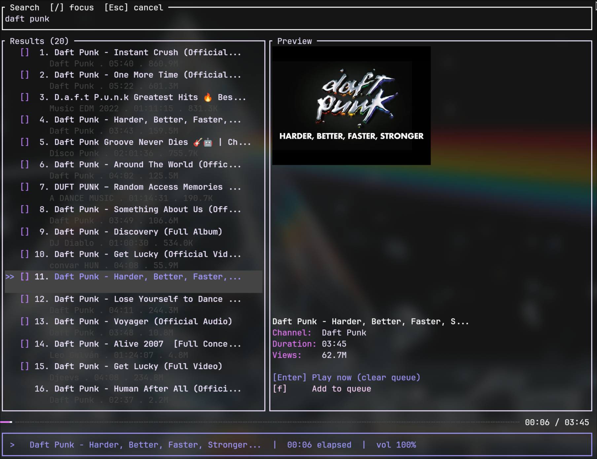

# listen_to_it

A terminal-based YouTube music player. Search for any song, browse results with album art previews, and play audio directly in your terminal — no browser required.



---

## Features

- **YouTube search** — search by title, artist, or any query and get 10 results instantly
- **Thumbnail preview** — album art displayed inline if your terminal supports it (Kitty, iTerm2, WezTerm)
- **Queue management** — add tracks to a queue and skip forward/backward
- **Progress bar** — clickable seek bar with current position and total duration
- **MPRIS2 integration** — media keys (play/pause/stop) work system-wide via D-Bus
- **Keyboard-driven** — fully operable without a mouse

---

## Dependencies

### Required

| Dependency | Purpose | Install |
|---|---|---|
| [Rust](https://rustup.rs) ≥ 1.75 | Build toolchain | `curl --proto '=https' --tlsv1.2 -sSf https://sh.rustup.rs \| sh` |
| [mpv](https://mpv.io) | Audio playback backend | `pacman -S mpv` / `apt install mpv` |

> **yt-dlp** is managed automatically — on first run the app downloads the official standalone binary to `~/.cache/listen_to_it/`. No manual installation needed.

### Audio backend (one of)

| Option | Notes |
|---|---|
| **PipeWire** | Recommended on modern Linux distros |
| **PulseAudio** | Works via PipeWire's PulseAudio compatibility layer |

mpv will use whatever audio server is running — no extra configuration needed.

### Optional

| Dependency | Purpose |
|---|---|
| A terminal with image protocol support | Inline thumbnail display (Kitty, WezTerm, iTerm2) |
| A D-Bus session (standard on any desktop) | MPRIS2 media key support |

---

## Building and running

```bash
git clone https://github.com/viniromao/listen_to_it
cd listen_to_it

# Build (release recommended for performance)
cargo build --release

# Run
./target/release/listen_to_it
```

Or run directly with cargo:

```bash
cargo run --release
```

The first build will take a minute to compile all dependencies.

---

## Keybindings

### Navigation

| Key | Action |
|---|---|
| `/` or `s` | Open search bar |
| `Esc` | Close search bar |
| `j` / `↓` | Move selection down |
| `k` / `↑` | Move selection up |
| `Enter` | Play selected track (clears queue) |
| `f` | Add selected track to queue |
| `q` | Quit |

### Playback

| Key | Action |
|---|---|
| `Space` | Pause / resume |
| `h` / `←` | Seek back 5 seconds |
| `l` / `→` | Seek forward 5 seconds |
| `[` | Skip to previous track in history |
| `]` | Skip to next track in queue |
| `+` / `=` | Volume up 5% |
| `-` | Volume down 5% |
| `d` | Toggle thumbnail visibility |

### Mouse

| Action | Effect |
|---|---|
| Click on the progress bar | Jump to that position in the song |

---

## How it works

1. **Search** — queries YouTube via `yt-dlp` and returns the top 20 results with thumbnails and metadata
2. **yt-dlp auto-setup** — on first run the app checks for `yt-dlp` in `$PATH`; if absent, downloads the official standalone binary to `~/.cache/listen_to_it/` automatically
3. **Playback** — `mpv` receives the YouTube URL and resolves the best audio stream via its built-in `yt-dlp` integration, communicating with the app through a Unix socket (`/tmp/listen_to_it_mpv.sock`) for pause, seek, and volume control
4. **Thumbnails** — downloaded asynchronously and rendered inline using `ratatui-image` if the terminal supports a graphics protocol
5. **MPRIS2** — `souvlaki` publishes the current track metadata on D-Bus so media keys and widgets (e.g. waybar, playerctl) work normally

---

## Troubleshooting

**No audio / mpv fails to start**
- Make sure `mpv` is installed and accessible in `$PATH`: `which mpv`
- Test manually: `mpv --no-video "https://www.youtube.com/watch?v=dQw4w9WgXcQ"`

**Search returns no results**
- Delete the cached binary to force a fresh download: `rm ~/.cache/listen_to_it/yt-dlp`
- YouTube occasionally changes their API; the next launch will download the latest yt-dlp automatically

**No thumbnail in the preview panel**
- Thumbnails require a terminal that implements the Kitty graphics protocol or iTerm2 protocol
- Tested terminals: Kitty, WezTerm, iTerm2
- In unsupported terminals the preview panel will show text metadata only

**Media keys not working**
- Requires a D-Bus session bus (standard on any desktop environment)
- Check with: `playerctl status`

---

## License

MIT
